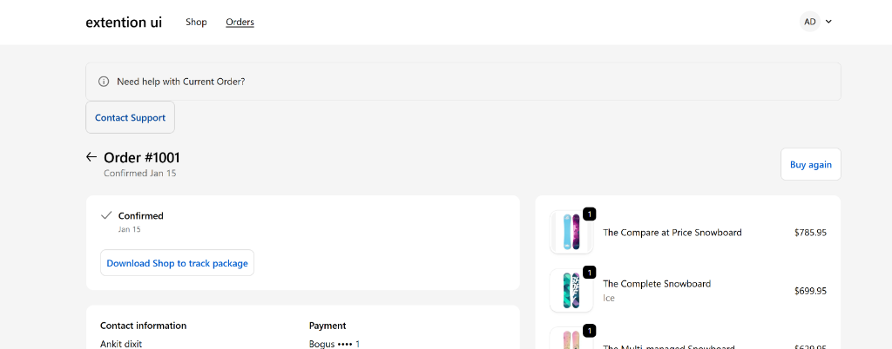
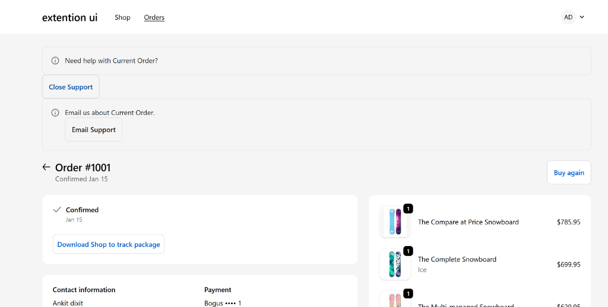

# Shopify Store Extensions & Theme Customization

This repository contains:

1.  **Shopify Customer Account UI Extension**: "Order Help" feature.
2.  **Shopify Theme Customization**: Custom "Product Key Info" section with a Size Guide drawer.

---

## 📸 Proof of Functionality

### UI Extension (Order Status Page)


_The "Need help with Current Order?" banner and contact button._


_The modal that opens on click, showing support options._

### Live Demo

- **Store URL**: [https://salman-store-setup.myshopify.com](https://salman-store-setup.myshopify.com/?_ab=0&_bt=eyJfcmFpbHMiOnsibWVzc2FnZSI6IkJBaEpJaVZ6WVd4dFlXNHRjM1J2Y21VdGMyVjBkWEF1YlhsemFHOXdhV1o1TG1OdmJRWTZCa1ZVIiwiZXhwIjoiMjAyNi0wMS0xNlQwNjozMDozMC42OTNaIiwicHVyIjoicGVybWFuZW50X3Bhc3N3b3JkX2J5cGFzcyJ9fQ%3D%3D--5f8b776dd29658472e1d6ba8216d9cf5fcef157c&_fd=0&_sc=1&key=3d2f3707a660382dbc93e9c0a92c4e69e6cfab5a3c9788a98b452ebf910fb7e5&preview_theme_id=151014834407)
- **Password**: `123`

---

## 📂 Project Structure

```
.
├── customer_ui_extension/
│   └── extensions/
│       └── customer-account-ui/
│           └── src/
│               └── OrderStatusBlock.jsx  # Main Extension Logic
├── shopify_theme/           # Theme Liquid Files
│   └── sections/
│       └── product-key-info.liquid  # [Theme Change] New section
└── screenshots/             # Images for documentation
```

---

## 1. Shopify Theme Changes

**Feature**: "Product Key Info" Section with Size Guide Drawer.
**File**: `shopify_theme/sections/product-key-info.liquid`

### How it works:

- Adds a section to the product page displaying the Title and Price.
- Includes a **Size Guide** button that opens a sliding drawer.
- **Storefront API Integration**: Fetches `metaobjects` (type: `size_guide`) via GraphQL to dynamically populate the drawer content.
- **Interactions**:
  - `onClick`: Toggles the drawer visibility with CSS transitions.
  - `onKeydown`: Supports `ESC` key to close for accessibility.

### Setup:

1.  Upload the `shopify_theme` folder to your store (or just the `.liquid` file to the online editor).
2.  Add the **Product Key Info** section to a Product Template in the Theme Editor.
3.  Ensure you have a Metaobject definition for `size_guide` to fetch data.

---

## 2. Customer UI Extension

**Feature**: "Need help with this order?" Block.
**Location**: Customer Account > Order Status Page.

### Setup Instructions:

1.  Navigate to the directory:
    ```bash
    cd customer_ui_extension
    ```
2.  Install dependencies:
    ```bash
    npm install
    ```
3.  Run the development server:
    ```bash
    npm run dev
    ```

### API Usage

- **Extension Target**: `customer-account.order-status.block.render`
- **Libraries**:
  - `@shopify/ui-extensions/preact`: For component rendering.
  - `useApi()` hook: Used to access the current `order` object properties (like `order.name`) to display dynamic text (e.g., "Need help with Order #1001?").

### Known Limitations

- The email address in the mailto link is currently hardcoded (`support@example.com`).
- The Storefront API token in the Theme Section is client-side implementation for demonstration; for production, ensure scope permissions are limited or use a proxy.

---
